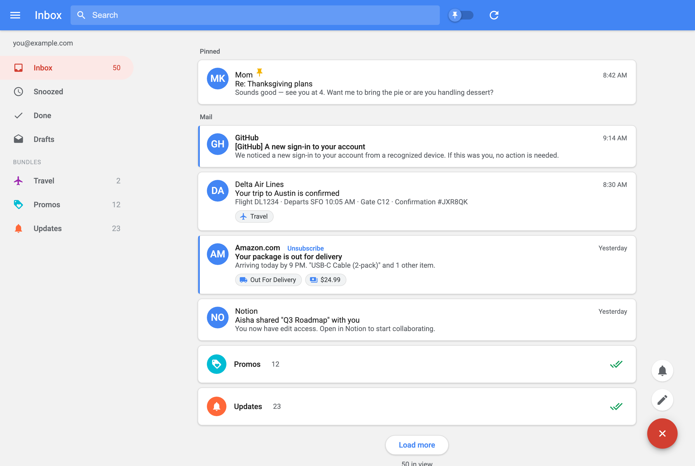

# Inbox — a Google Inbox clone over the Gmail API

A local, single-user email client that recreates the look and triage model of the
deprecated **Inbox by Gmail**, with one-tap **Send to Things 3** that backlinks
straight to the email.



> *Screenshot uses mock data; the app runs against your own Gmail.*

Reverse-engineered from a detailed UX spec of the original product — see
**[docs/DESIGN.md](docs/DESIGN.md)** for the full design document (colors, typography,
components, interactions, and history).

## Architecture
- **Backend:** `app.py` — Flask + Gmail API (`uv run --script`, deps inline via PEP 723).
- **Frontend:** `templates/index.html` + `static/{style.css,app.js}` — vanilla SPA styled to the Inbox spec.
- **Launcher:** `~/Desktop/Apps/Inbox.app` — starts the server, opens the browser, and handles `inboxclone://` deep links.
- **Port:** `http://127.0.0.1:5008`

## Triage model (maps Inbox semantics onto native Gmail labels)
| Inbox action | Gmail mechanism |
|---|---|
| Done | remove `INBOX` label (archive) |
| Pin | `STARRED` label |
| Snooze | remove `INBOX` + add `Snoozed`; background scheduler re-adds `INBOX` at wake time (state in `snooze.db`) |
| Bundles | native categories (Promos/Social/Updates/Forums) + keyword classifier for Travel/Purchases/Finance |

## Send to Things 3
Each thread/card has a **Send to Things** action. It fires:
```
things:///add?title=<subject>&notes=<backlink + gmail fallback + sender/snippet>
```
The note's backlink is `inboxclone://thread/<threadId>?gmail=<gmail permalink>`.
Tapping it in Things launches **Inbox.app** (starting the server if needed) and reopens
the exact thread; if the clone can't serve it, it falls back to the Gmail web permalink.

## Credentials (GITIGNORED — must be rebuilt on a fresh clone)
This repo intentionally ships **no credentials**. To run:
1. Google Cloud Console → create a project → enable the **Gmail API**.
2. OAuth consent screen → **External**, add yourself as the user; set publishing status
   to **In production** (avoids the 7-day refresh-token expiry that "Testing" imposes).
3. Create an **OAuth client ID → Desktop app**; download the JSON.
4. Save it as `credentials/client_secret.json`.
5. First launch opens a Google consent page — approve (click *Advanced → Go to app* past
   the unverified-app warning). A `credentials/token.json` is written (chmod 600) and reused.

Scopes used: `gmail.modify` (read/label/archive) + `gmail.send` (compose/reply). No delete scope.

## Setup (one-time) — the lean venv the launcher uses
```
cd ~/Documents/inbox-clone
uv venv .venv
uv pip install --python .venv/bin/python flask google-auth google-auth-oauthlib \
  requests pywebview pyobjc-framework-Cocoa pyobjc-framework-WebKit
```
`Inbox.app` runs `./.venv/bin/python desktop.py` directly (no `uv` at runtime — saves
~40MB of wrapper process). The Gmail layer uses raw HTTPS via google-auth's
`AuthorizedSession` (no google-api-python-client/httplib2 — keeps RAM ~276MB total,
~2.3x lighter than Chrome).

## Run
- **Native desktop app (default):** double-click `~/Desktop/Apps/Inbox.app` → native macOS
  **WKWebView** window (system WebKit, no Chromium). Starts the server in-process; quitting
  the window stops everything. Singleton: a second launch no-ops if one is running.
- **Browser fallback:** `cd ~/Documents/inbox-clone && uv run --script app.py`, then open
  `http://127.0.0.1:5008` in any browser.

## Deep links with the native window
`inboxclone://` is owned by a hidden helper, **`~/Desktop/Apps/Inbox Link Handler.app`**
(`link_handler.applescript`, `LSUIElement`). On a Things backlink it ensures Inbox.app is
running, then `POST /api/open_thread`; the SPA receives a `focus` event over SSE and opens
that thread (falls back to the Gmail web permalink if the app can't start).
External links *inside emails* are routed to the default browser via pywebview's
`js_api.open_external` (WKWebView can't open new tabs itself).

## Implemented
- Inbox list with Bundles, Pin (★), Done (archive), Snooze (real, scheduler-backed)
- **Snoozed** view (with wake-time labels) and **Done** view (recently archived)
- **Search** — Gmail query syntax via the top search bar (Enter to run)
- **Highlights chips** on cards — Travel/shipping/order/price, heuristic from subject+snippet
- **Snooze presets** — Later today / Tomorrow / This weekend / Next week / Someday / **Pick date & time**
- Nav **bundle filters** (click a bundle in the drawer to see just its mail)
- Pagination — loads 100 messages/page with a **Load more** button (raises the limit by
  100, capped at 500/page). Metadata fetched in chunked batches of 50 (Gmail's batch cap).
  Applies to inbox, snoozed, done, and search; live-sync refresh keeps the loaded depth.
- Compose + inline reply (Gmail API send, threaded)
- Send-to-Things with `inboxclone://` backlink + Gmail fallback (right-most action everywhere)
- **Multi-select** — hover a card's avatar to reveal a checkbox; selecting shows a top
  bulk-action bar (Pin / Snooze / Done / Send to Things) acting on all selected at once.
- **Re-label / move to bundle** — card + reader "label" action moves an email to any bundle
  via a `Bundle/<name>` Gmail label that overrides the heuristic + native category. Checkbox
  **"Apply to future from [sender]"** creates a Gmail **filter** so future mail from that sender
  auto-lands there. Needs the `gmail.settings.basic` scope (one-time re-consent).
- **One-click Unsubscribe** (RFC 2369 / RFC 8058) — inline link on inbox cards + a banner
  at the top of the email, shown only when a `List-Unsubscribe` header exists. Server
  re-reads headers at action time and: (1) one-click → `POST List-Unsubscribe=One-Click`
  to the https URI; (2) mailto → sends an unsubscribe email from your account; (3) plain
  https link → opens in the browser. Confirmation prompt guards accidental clicks.
- **Live sync** — a background thread polls Gmail's History API for deltas and pushes
  them to the browser over SSE (`/api/stream`); the UI auto-refreshes (preserving scroll +
  expanded bundles + selection). No manual Refresh needed. Requires `threaded=True` on the
  Flask server. (Chosen over Gmail Pub/Sub push, which needs a public HTTPS endpoint
  a 127.0.0.1 app can't provide without a tunnel.)

## Not yet built
- Snooze-by-location (geofencing isn't feasible from a local web app; Inbox itself
  retired it in 2018 — replaced here by Pick date & time + Someday)
- True schema.org/ML Highlights (current chips are keyword heuristics on metadata)
- True Gmail Pub/Sub push (would need a public webhook / tunnel; SSE+History covers it)
