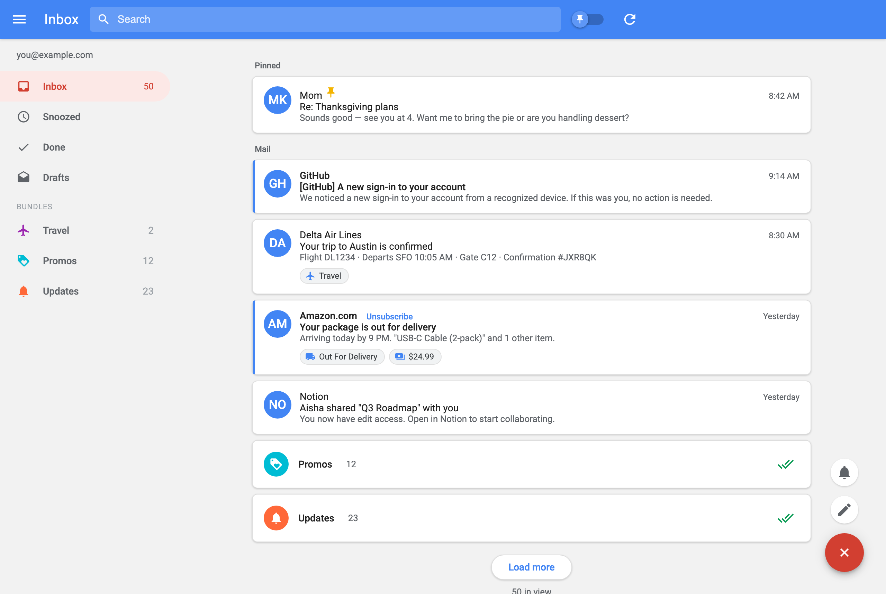

# Inbox: a Google Inbox clone over the Gmail API

A local, single-user email client that recreates the look and triage model of the
deprecated **Inbox by Gmail**, with one-tap **Send to Things 3** that backlinks
straight to the email.



> *Screenshot uses mock data; the app runs against your own Gmail.*

Reverse-engineered from a detailed UX spec of the original product; see
**[docs/DESIGN.md](docs/DESIGN.md)** for the full design document (colors, typography,
components, interactions, and history).

> 🤖 **Android:** a native Kotlin/Compose app lives in [`android/`](android/README.md), with a setup wizard that connects a fresh Gmail account without a terminal. `./android/scripts/build-apk.sh` produces one signed 2.4 MB APK you can hand to someone.

> 📱 **iPhone:** a native SwiftUI app exists in a separate private repo (checked out at `ios/` next to this code, which the gitignore skips). Mac-independent (talks to Gmail directly), same triage model, same Send to Things backlinks. It replaced the PWA plan in [docs/ROADMAP.md](docs/ROADMAP.md).

## Architecture
- **Backend:** `app.py`: Flask + Gmail API (`uv run --script`, deps inline via PEP 723).
- **Frontend:** `templates/index.html` + `static/{style.css,app.js}`: vanilla SPA styled to the Inbox spec.
- **Launcher:** `/Applications/Inbox.app`: starts the server, opens the browser, and handles `inboxclone://` deep links.
- **Port:** `http://127.0.0.1:5008`

## Triage model (maps Inbox semantics onto native Gmail labels)
| Inbox action | Gmail mechanism |
|---|---|
| Done | remove `INBOX` label (archive) |
| Pin | `STARRED` label |
| Snooze | remove `INBOX` + add `Snoozed`; background scheduler re-adds `INBOX` at wake time (state in `snooze.db`) |
| Bundles | native categories (Promos/Social/Updates/Forums) + keyword classifier for Travel/Purchases/Finance |
| Report spam | add `SPAM` + remove `INBOX`/`UNREAD` (undo re-adds `INBOX`, drops `SPAM`) |
| Block sender | Gmail filter on `from:` whose action is `TRASH`, plus trashing the thread in hand |

## Send to Things 3
Each thread/card has a **Send to Things** action. It fires:
```
things:///add?title=<subject>&notes=<backlink + gmail fallback + sender/snippet>
```
The note's backlink is `inboxclone://thread/<threadId>?gmail=<gmail permalink>`.
Tapping it in Things launches **Inbox.app** (starting the server if needed) and reopens
the exact thread; if the clone can't serve it, it falls back to the Gmail web permalink.

## Credentials (GITIGNORED, must be rebuilt on a fresh clone)
This repo intentionally ships **no credentials**. To run:
1. Google Cloud Console → create a project → enable the **Gmail API**.
2. OAuth consent screen → **External**, add yourself as the user; set publishing status
   to **In production** (avoids the 7-day refresh-token expiry that "Testing" imposes).
3. Create an **OAuth client ID → Desktop app**; download the JSON.
4. Save it as `credentials/client_secret.json`.
5. First launch opens a Google consent page; approve (click *Advanced → Go to app* past
   the unverified-app warning). A `credentials/token.json` is written (chmod 600) and reused.

Scopes used: `gmail.modify` (read/label/archive) + `gmail.send` (compose/reply). No delete scope.

## Setup (one-time): the lean venv the launcher uses
```
cd ~/Documents/inbox-clone
uv venv .venv
uv pip install --python .venv/bin/python flask google-auth google-auth-oauthlib \
  requests pywebview pyobjc-framework-Cocoa pyobjc-framework-WebKit
```
`Inbox.app` runs `./.venv/bin/python desktop.py` directly (no `uv` at runtime, which saves
~40MB of wrapper process). The Gmail layer uses raw HTTPS via google-auth's
`AuthorizedSession` (no google-api-python-client/httplib2, which keeps RAM ~276MB total,
~2.3x lighter than Chrome).

## Run
- **Native desktop app (default):** double-click `/Applications/Inbox.app` → native macOS
  **WKWebView** window (system WebKit, no Chromium). Starts the server in-process; quitting
  the window stops everything. Singleton: a second launch no-ops if one is running.
- **Browser fallback:** `cd ~/Documents/inbox-clone && uv run --script app.py`, then open
  `http://127.0.0.1:5008` in any browser.

## Deep links with the native window
`inboxclone://` is owned by a hidden helper, **`~/Library/Application Support/Inbox/Inbox
Link Handler.app`** (`link_handler.applescript`, `LSUIElement`). On a Things backlink it
ensures Inbox.app is running, then `POST /api/open_thread`; the SPA receives a `focus`
event over SSE and opens that thread (falls back to the Gmail web permalink if the app
can't start). A bare `inboxclone://` just opens/raises the app (used by summary
notifications).
External links *inside emails* are routed to the default browser via pywebview's
`js_api.open_external` (WKWebView can't open new tabs itself).

## Implemented
- Inbox list with Bundles, Pin (★), Done (archive), Snooze (real, scheduler-backed)
- **Snoozed** view (with wake-time labels) and **Done** view (recently archived)
- **Search**: Gmail query syntax via the top search bar (Enter to run)
- **Highlights chips** on cards: Travel/shipping/order/price, heuristic from subject+snippet
- **Snooze presets**: Later today / Tomorrow / This weekend / Next week / Someday / **Pick date & time**
- Nav **bundle filters** (click a bundle in the drawer to see just its mail)
- Pagination: loads 100 messages/page with a **Load more** button (raises the limit by
  100, capped at 500/page). Metadata fetched in chunked batches of 50 (Gmail's batch cap).
  Applies to inbox, snoozed, done, and search; live-sync refresh keeps the loaded depth.
- Compose + inline reply (Gmail API send, threaded)
- Send-to-Things with `inboxclone://` backlink + Gmail fallback (right-most action everywhere)
- **Multi-select**: hover a card's avatar to reveal a checkbox; selecting shows a top
  bulk-action bar (Pin / Snooze / Done / Send to Things) acting on all selected at once.
- **Re-label / move to bundle**: card + reader "label" action moves an email to any bundle
  via a `Bundle/<name>` Gmail label that overrides the heuristic + native category. Checkbox
  **"Apply to future from [sender]"** creates a Gmail **filter** so future mail from that sender
  auto-lands there. Needs the `gmail.settings.basic` scope (one-time re-consent).
- **Unsubscribe without the click-through** (RFC 2369 / RFC 8058): inline link on inbox
  cards + a banner at the top of the email, shown when a `List-Unsubscribe` header exists
  or a body scan found an opt-out link. The server re-reads headers at action time and
  walks a ladder, stopping at the first rung that works: (1) `POST List-Unsubscribe=One-Click`
  to the https URI when the sender advertises RFC 8058; (2) **the sender's confirmation
  page, driven to completion server-side**: it follows redirects (including meta-refresh
  and `window.location`), fills the confirm form, keeps the hidden tokens, ticks the
  opt-out radio, types your address into the "which address?" box, answers the reason
  dropdown, presses the confirm button, and repeats for a second confirm screen, up to
  four rounds; (3) a one-click POST the sender never advertised, accepted only if the
  response says in words that you are off the list; (4) **the page again in a real
  WebKit engine**, offscreen, for opt-outs that only exist once the page's scripts have
  run: it ticks the opt-out control, types your address, presses the confirm button and
  reads the result (needs the desktop shell's AppKit loop, so bare `python app.py` skips
  this rung); (5) the `mailto:` route, sent from your account; (6) the browser, and only
  once all of that has failed. Every hop is
  SSRF-checked (https + publicly-resolving host), login forms are never submitted, and a
  page that says "we're sorry to see you go" above a confirm button is not mistaken for
  success. Confirmation prompt guards accidental clicks.
- **Report spam**: card action, reader action, bulk-bar action, and Gmail's own `!` key.
  Undo ("not spam") is on the snackbar, and it both restores `INBOX` and clears `SPAM` so
  Gmail stops re-filing the thread.
- **Block sender**: reader action (and a Settings field to block an address by hand). Creates
  the same object Gmail's own Block does, a `from:` filter whose action is Trash, so blocks
  made here show up in Gmail's Settings → Filters and unblocking in either place works.
  Filters only apply to mail that arrives after they exist, so the open thread is trashed
  too; undo deletes the filter and un-trashes it. Settings lists every blocked sender with
  an Unblock button, read live from the account.
- **Embedded images**: `` parts are rewritten server-side to an
  `/api/inline/<msg>/<att>` proxy, so images attached to a message actually render instead
  of showing as broken. These bytes arrived with the mail, so they display even when remote
  images are blocked; the blocking CSP allows `data:` + same-origin only, which still cuts
  off remote tracking pixels. Remote images load by default (Settings → "Block remote
  images" turns tracker-blocking on).
- **Live sync**: a background thread polls Gmail's History API for deltas and pushes
  them to the browser over SSE (`/api/stream`); the UI auto-refreshes (preserving scroll +
  expanded bundles + selection). No manual Refresh needed. Requires `threaded=True` on the
  Flask server. (Chosen over Gmail Pub/Sub push, which needs a public HTTPS endpoint
  a 127.0.0.1 app can't provide without a tunnel.)
- **Desktop notifications**: when the live-sync poller sees new *unread* inbox mail it
  fires a full macOS banner attributed to **Inbox** (sender as title, subject as subtitle,
  body snippet as the message, real app icon, optional sound); clicking opens that exact
  thread via `inboxclone://`. Repeated mail on one thread replaces its stale banner
  (`-group`), and a burst collapses into one summary banner whose click raises the app.
  Toggles in Settings → "Desktop notifications for new mail" / "Play sound with
  notifications". Requires `terminal-notifier` (`brew install terminal-notifier`) plus a
  one-time `./setup_notifier.sh`, which builds **Inbox Notifier.app** (a rebranded
  terminal-notifier copy in `~/Library/Application Support/Inbox/`) so Notification Center
  shows the Inbox name/icon and gives the app its own row in System Settings →
  Notifications. Without that bundle it falls back to plain terminal-notifier with the
  favicon pasted in (attributed to Terminal); `export INBOX_NOTIFY_SENDER=<app-bundle-id>`
  can dress up that fallback.

## Not yet built
- Snooze-by-location (geofencing isn't feasible from a local web app; Inbox itself
  retired it in 2018; replaced here by Pick date & time + Someday)
- True schema.org/ML Highlights (current chips are keyword heuristics on metadata)
- True Gmail Pub/Sub push (would need a public webhook / tunnel; SSE+History covers it)
